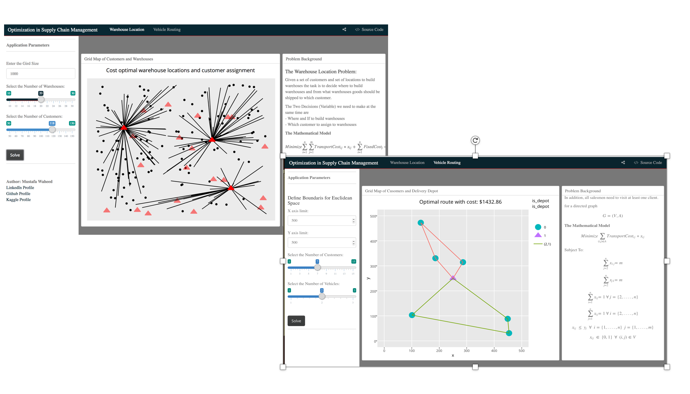

## This application shows some simple examples of Supply Chain Optimization problems
_by Mustafa Waheed_

This application is still long ways from being finished. I will be updating it regularly over this week starting 01/08/2017  
That is why currently is just shows simple MILP based example to the:  
  
  - Warehouse Location Problem
  
  - Multiple Travelling Salesman Problem
  
## Application Views

## Credit 
Inspired by the Jump Project in julia the credit goes to the ompR project by   
[Dirk Schumacher](https://github.com/dirkschumacher/ompr)
